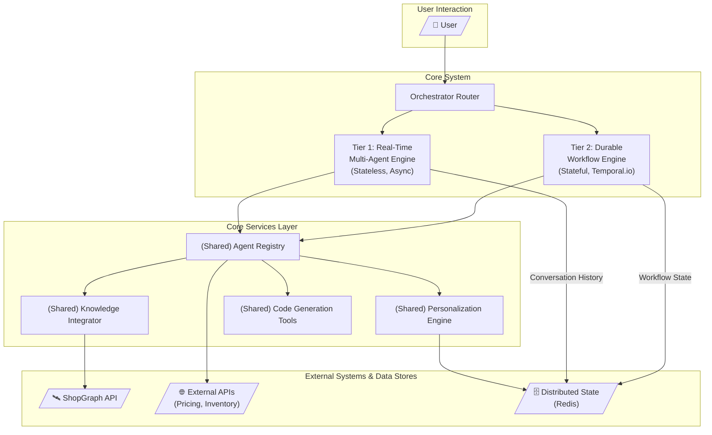

# Product.ai: System Architecture Design

**Version:** 1.0  
**Date:** July 20, 2025  
**Author:** Morteza Naraghi

---

## 1. High-Level Architecture

Product.ai is designed as a sophisticated, dual-architecture system that provides expert-level conversational shopping guidance. The architecture is built to handle the full spectrum of user interactions, from simple, real-time queries to complex, long-running purchasing journeys. At its core, an intelligent orchestrator routes requests to the most appropriate processing engine, ensuring optimal performance, scalability, and cost-effectiveness.

### 1.1. System Architecture Diagram

The following diagram illustrates the primary components and data flow of the Product.ai system.

### 1.2. Component Responsibilities and Interaction Patterns

*   **Orchestrator Router:** The single entry point for all user requests. Its primary responsibility is to analyze the user's intent and determine whether the request is a synchronous, conversational turn or a long-running, asynchronous task.
    *   **Interaction:** If synchronous, it passes control to the Real-Time Engine. If asynchronous (e.g., "watch this for me"), it initiates a workflow in the Durable Workflow Engine.

*   **Tier 1: Real-Time Multi-Agent Engine:** The system's workhorse, optimized for low-latency, stateless request-response cycles. It manages the conversational flow using a ReAct (Reason-Act) loop.
    *   **Interaction:** It interacts with the `AgentRegistry` to discover and invoke tools, the `PersonalizationEngine` to fetch user context, and Redis (`StateStore`) to persist conversation history.

*   **Tier 2: Durable Workflow Engine:** Powered by Temporal.io, this engine is designed for fault-tolerant, stateful, and long-running processes. It guarantees the execution of tasks that can last for minutes, days, or weeks.
    *   **Interaction:** It orchestrates `activities` which, like the real-time engine, invoke tools from the `AgentRegistry`. It relies on the Temporal service for state persistence, timers, and retries.

*   **Core Services Layer:** A collection of shared, stateless services that provide foundational capabilities to both engines.
    *   `AgentRegistry`: A thread-safe registry that maps available tools (e.g., `search_products`, `get_price`) to the specialized agents that provide them.
    *   `KnowledgeIntegrator`: A service that acts as the sole gateway to the ShopGraph API, transforming structured graph data into natural language insights for the LLM.
    *   `PersonalizationEngine`: Manages user profiles and conversation history, providing crucial context to the orchestrator.
    *   `CodeGen`: A specialized tool for on-demand code generation and execution, used for complex calculations.

### 1.3. Technology Stack Decisions

| Component                 | Technology        | Justification                                                                                                                                                             |
| ------------------------- | ----------------- | ------------------------------------------------------------------------------------------------------------------------------------------------------------------------- |
| Primary Language          | Python 3.9+       | The de facto standard for AI/ML development with an unparalleled ecosystem of libraries (e.g., LangChain, Transformers) and asynchronous support (asyncio) for high concurrency. |
| Real-Time Engine          | Custom Asyncio App| Provides maximum control over the ReAct loop and performance optimization. Avoids the overhead of heavier frameworks for simple, high-throughput tasks.                     |
| Durable Workflow Engine   | Temporal.io       | The industry standard for durable execution. Provides built-in support for retries, timers, state persistence, and fault tolerance, which is critical for high-value tasks.  |
| Distributed State Store   | Redis             | An in-memory data store that offers extremely low-latency reads and writes, making it ideal for caching conversation history, user profiles, and real-time product data.   |
| LLM Orchestration         | Custom (ReAct)    | A custom ReAct implementation provides more flexibility and control over the "thinking step" than off-the-shelf libraries, enabling dynamic error recovery and planning.   |
| Deployment                | Docker/Kubernetes | Containerization provides a consistent, scalable, and portable environment for deploying the various microservices that make up the Product.ai system.                     |

---

## 2. Core Components Design

The unique power of Product.ai comes from the tight, synergistic integration of its three core components: Agent Orchestration, ShopGraph Knowledge Integration, and Personalization.

### 2.1. Agent Orchestration Engine

The orchestration engine is the "brain" of the system. It uses a dynamic ReAct (Reason-Act) loop to process complex queries. Unlike a static workflow, it re-evaluates its plan after every step.

**How it works:**
1.  A user query is received (e.g., "Which of these two cameras is better for travel photography?").
2.  The orchestrator **Reasons**: It analyzes the query, conversation history, and user profile (provided by the Personalization Engine) and forms a thought: "I need to compare these two products. First, I need to get their detailed specifications, focusing on weight, lens options, and sensor size."
3.  It **Acts**: It selects the `get_product_specs` tool from the `AgentRegistry` and invokes it for both cameras.
4.  The tool (via the `KnowledgeIntegrator`) returns the specs from ShopGraph.
5.  The orchestrator observes the output and **Reasons** again: "Okay, I have the specs. Camera A is lighter, but Camera B has a better sensor. Now I need to synthesize this into a helpful comparison for a travel photographer."
6.  It **Acts**: It formulates a final, nuanced answer and delivers it to the user.

### 2.2. ShopGraph Knowledge Integration

The `KnowledgeIntegrator` service acts as a crucial bridge between the LLM's fluid reasoning and the hard, factual data in ShopGraph. It prevents hallucination and grounds the AI's responses in reality.

**How it enhances conversations:**
*   **Fact-Checking:** When the orchestrator decides to find products, it doesn't just ask the LLM to invent them. It calls a tool like `find_compatible_lenses`, which the `KnowledgeIntegrator` translates into a precise Cypher query for ShopGraph. The results are real, in-stock products.
*   **Insight Generation:** ShopGraph contains relational data competitors lack. The `KnowledgeIntegrator` can answer questions like "What are some cheaper alternatives to this product?" or "What accessories are most commonly bundled with this laptop?". This structured data is transformed into natural language for the LLM to use, creating unique, high-value insights.

### 2.3. Personalization & Recommendations

The `PersonalizationEngine` ensures that every conversation is tailored to the user, moving beyond a generic Q&A bot to a true personal assistant.

**How it adapts to users:**
1.  At the start of each turn, the orchestrator retrieves the user's profile and recent conversation history from the `PersonalizationEngine` (which fetches it from Redis).
2.  This context is injected directly into the reasoning prompt. For example: `User Profile: { "preferences": ["lightweight", "long battery life"], "past_purchases": ["Sony A7IV"] }`.
3.  This context fundamentally changes the LLM's reasoning. When asked for laptop recommendations, it will now prioritize lightweight models with good battery life. It might also say, "Since you own a Sony camera, you might like this Dell laptop with a built-in SD card reader for easy photo transfer."
4.  As the user expresses new preferences, the `PersonalizationEngine` updates their profile in Redis, ensuring the system learns and adapts throughout the conversation.

---

## 3. Agent Design Philosophy

### 3.1. Key Specialized Agents

The system uses a set of modular, specialized agents. Each is a stateless class that exposes a set of tools to the central orchestrator.

1.  **`ProductDiscoveryAgent`**:
    *   **Specification:** Responsible for finding and retrieving product information.
    *   **Tools Exposed:** `search_products(query)`, `get_product_specs(product_id)`, `find_alternatives(product_id)`, `get_compatibility(product_a, product_b)`.

2.  **`PriceAnalysisAgent`**:
    *   **Specification:** Handles all real-time pricing and availability queries.
    *   **Tools Exposed:** `get_current_price(product_id)`, `find_best_deals(category)`, `get_price_history(product_id)`.

3.  **`ClarificationAgent`**:
    *   **Specification:** A meta-agent used by the orchestrator when it determines it lacks sufficient information.
    *   **Tools Exposed:** `ask_user_for_details(question)`. The orchestrator's reasoning loop decides *what* to ask.

4.  **`CodeGenAgent`**:
    *   **Specification:** A powerful agent for on-the-fly calculations and data analysis.
    *   **Tools Exposed:** `codegen_fast(code_snippet)`, `codegen_slow(complex_code_snippet)`. Used for tasks like "Which of these has the best price-to-performance ratio?".

### 3.2. Agent Communication and Coordination

*   **Pattern:** We use a **centralized, orchestrator-led** communication pattern. Agents do not communicate with each other directly. This avoids the complexity and potential chaos of decentralized negotiation.
*   **Mechanism:** The orchestrator coordinates agents by invoking their tools. An agent's "turn" is simply the execution of one of its tools. The orchestrator is responsible for chaining these calls together to form a coherent plan.

### 3.3. Context Sharing and Coherence

Conversation coherence is maintained centrally by the orchestrator.
*   **State:** The full conversation history is stored in Redis.
*   **Context:** For each reasoning step, the orchestrator loads the relevant history and user profile and includes it in the prompt to the LLM. This ensures every decision is made with the full context of the conversation. Agents themselves are stateless; they only receive the information needed to execute a specific tool.

### 3.4. Failure Handling and Fallback Strategies

*   **Tool Failures:** If an agent's tool fails (e.g., an external API times out), it raises an exception. The orchestrator catches this exception and incorporates the failure into its next reasoning step. For example: "The PriceAnalysisAgent failed to get a price. I should inform the user that I can't access pricing right now and ask if they'd like me to proceed with the comparison based on specs alone."
*   **Reasoning Failures:** If the orchestrator gets stuck in a loop or fails to make progress, a simple max iteration count acts as a fallback, exiting the loop and providing a helpful message to the user.
*   **Circuit Breakers:** We implement circuit breakers on calls to external APIs. If an API is consistently failing, the breaker will trip, and the corresponding tool will be temporarily marked as "unavailable" in the orchestrator's context, preventing repeated failed calls.

---

## 4. Data Architecture

### 4.1. Structured Knowledge and LLM Integration

Our data architecture fuses the structured, factual knowledge of ShopGraph with the flexible, reasoning capabilities of LLMs. The LLM is never trusted to know factual product data. Instead, its role is to act as a "reasoning engine" that decides which questions to ask of our structured data sources. All factual claims in a response are grounded in data retrieved from ShopGraph or other verified external APIs.

### 4.2. Real-Time Data Handling

*   **Pricing & Inventory:** These are highly volatile. Agent tools that need this data always call the relevant external APIs in real-time.
*   **Caching:** The results of these API calls are stored in Redis with a short TTL (e.g., 1-5 minutes). This ensures that if the same data is needed multiple times in a short conversation, we can serve it instantly from the cache without repeated API calls, reducing latency and cost.

### 4.3. Conversation State Management

*   **Storage:** All conversation state (message history, user ID, session context) is stored in a Redis hash.
*   **Retention:** This allows for seamless context retention. A user can leave and come back hours later, and the orchestrator can reload the previous state to continue the conversation exactly where it left off.

### 4.4. Performance Optimization Strategies

*   **Multi-Layer Caching:** As described, we use aggressive caching with varying TTLs for different types of data.
*   **Asynchronous I/O:** The entire real-time engine is built on Python's `asyncio`, allowing it to handle thousands of concurrent I/O-bound operations (like API calls) efficiently.
*   **"Latency Ladder" for Tooling:** For tasks like code generation, we provide both a fast/cheap model and a slow/powerful model. The orchestrator is prompted to always try the `codegen_fast` tool first, only escalating to the more expensive tool if the simpler one fails.

---

## 5. Competitive Differentiation

### 5.1. Comparison to Existing Solutions

| Competitor                  | Their Weakness                                                                                                                          | Our Advantage (The Moat)                                                                                                                                                             |
| --------------------------- | --------------------------------------------------------------------------------------------------------------------------------------- | ------------------------------------------------------------------------------------------------------------------------------------------------------------------------------------ |
| **Google Shopping AI / Amazon Rufus** | Recommendations are often generic, heavily influenced by advertising spend, and struggle with complex, multi-constraint queries. They lack deep relational product knowledge. | Our **ShopGraph Integration** provides a deep well of proprietary, relational data (compatibility, alternatives, bundles), allowing us to offer truly expert, unbiased advice.          |
| **Perplexity Shopping**           | Excellent at summarizing web content and reviews but lacks access to structured, real-time data like inventory, precise compatibility, or historical pricing. Its answers are summaries, not definitive truths. | Our **Real-Time Data Handling** and direct API integrations provide grounded, actionable information. The **Durable Workflow Engine** unlocks stateful services (like price tracking) that are impossible for them. |

### 5.2. How ShopGraph Creates Unique Value

ShopGraph is not just a product catalog; it's a relational graph of the entire e-commerce landscape. This allows us to answer questions no one else can:
*   "Will the lens from my old Canon camera fit this new Sony model?" (Compatibility)
*   "This graphics card is sold out. What's a slightly less powerful but available alternative?" (Alternatives)
*   "What kind of power adapter and memory card do people usually buy with this camera?" (Bundles & Relationships)

This structured knowledge, when wielded by a powerful reasoning engine, creates an unparalleled expert experience.

### 5.3. Technical Moats

1.  **The Durable Workflow Engine:** Our Temporal.io integration is a powerful and hard-to-replicate technical moat. It allows us to offer high-value, stateful services like price monitoring, automated purchasing, and multi-day guided shopping journeys that stateless competitors cannot match.
2.  **The Dynamic ReAct Orchestrator:** The "thinking step" allows our system to reason about its own actions and recover from errors in a flexible way that is far more robust than static, predefined agent workflows (like LangChain's basic chains or CrewAI's static processes).
3.  **Proprietary Data Flywheel:** The deep integration with ShopGraph creates a data flywheel. As users interact with the system, we learn which product relationships are most valuable, which we can then use to enrich the graph, further improving the assistant's expertise. 